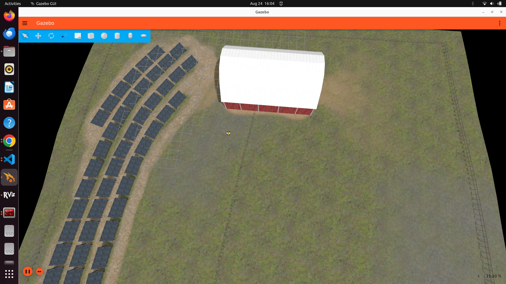

# Agrirobot Navigation

Defines the ROS2 Navigation setups for the zinger 4 wheel steering robot

### Gazebo Ignition Environment

|  |  |  |
|:-----------------------------:|:-----------------------------:|:-----------------------------:|

### Rviz2

|  |  |  |
|:-----------------------------:|:-----------------------------:|:-----------------------------:|

### Autonomy task

## Dependencies

The configurations in this repository assume you have the following prerequisites installed on the
device on which you want to run this code. That device might be an Ubuntu machine or a physical
robot using Raspberry Pi OS.

1. [ROS humble](https://docs.ros.org/en/humble/Releases/Release-Humble-Hawksbill.html) 
2. Gazebo Ignition
3. Ubuntu 22.04
## Contents

This repository contains different folders for the different parts of the navigation and SLAM configuration
for the zinger robot.

* The config files that provide the configurations for the navigation and the SLAM stacks.
  * [config/nav2.yaml](config/nav2.yaml) defines the settings for the Nav2 stack.
  * [config/slam.yaml](config/slam.yaml) defines the settings for the SLAM stack.
* The launch directory contains the launch files
  * [launch/nav2.launch.py](launch/nav2.launch.py) launches the Nav2 stack.
  * [launch/slam.launch.py](launch/slam.launch.py) launches the SLAM stack.

## Configurations

### Nav2 configuration

The Nav2 configuration is based on the `nav2_bringup` package. The configuration file is located in
the `config` directory and is called `nav2.yaml`. The Nav2 stack is configured with:

* [SmacPlannerLattice](https://navigation.ros.org/configuration/packages/smac/configuring-smac-lattice.html)
  as the global planner, or planner in Nav2 terms. The standard values for the parameters for the
  SmacPlannerLattice are used.
* [MPPIController](https://navigation.ros.org/configuration/packages/configuring-mppic.html) as the
  local planner, or controller in Nav2 terms. The standard values for the parameters for the
  MPPIController are used, except that some values were adjusted to match the capabilities of the robot.

### SLAM configuration

The SLAM configuration is based on the `slam_toolbox` package. The configuration file is located in
the `config` directory and is called `slam.yaml`. The configuration file uses the standard configurations
from the `slam_toolbox` package.

## Usage

The `zinger_nav` contains two different launch files that each can be launched either in the Gazebo
simulator or in the real world on a physical robot. In order to launch either the SLAM stack or the
navigation stack you will need to have both the robot description loaded and the `zinger_swerve_controller`
package running. When running in a simulation in Gazebo you can start these two by running the following
commands in two different terminals.

    ros2 launch zinger_ignition ignition.launch.py rviz:=true world:=agriculture

    ros2 launch zinger_swerve_controller swerve_controller.launch.py use_sim_time:=true

### Launch the navigation stack

To launch the navigation stack in the Gazebo

    ros2 launch zinger_nav nav2.launch.py use_sim_time:=true

### Launch the SLAM stack

In order to launch the SLAM stack in the Gazebo simulator use

    ros2 launch zinger_nav slam.launch.py use_sim_time:=true

### Notes

When using RViz to visualize the robot and the navigation stack, make sure to set the fixed frame to
`map`, otherwise there will be no navigation information available.

### Acknowledgements

This is project is built upon :

1. [Petrik van der Velde's project](https://github.com/pvandervelde/zinger_nav.git)
2. [The humming bird's project](https://github.com/thehummingbird/nav2_demo_turtlebot3.git)
3. [Nav2](https://docs.nav2.org/index.html)